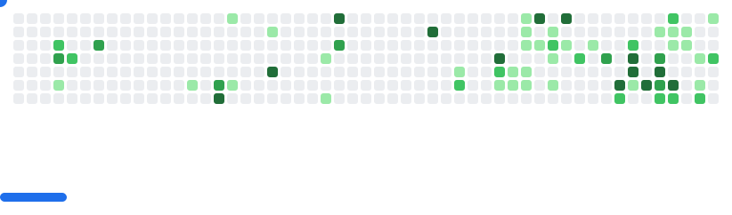

- 👋 Hi, I’m @Sohamactive
- 👀 I’m interested in competitve programming & web development
- 🌱 I’m currently learning cpp(competitve) and building projects
- 📫 How to reach me :[linkedin](https://www.linkedin.com/in/sohamactive/),[X](https://x.com/Sohamactive)

<picture>
  <source
    media="(prefers-color-scheme: dark)"
    srcset="images/breakout-dark.svg"
  />
  <source
    media="(prefers-color-scheme: dark)"
    srcset="images/breakout-light.svg"
  />
  
</picture>

<!---
Sohamactive/Sohamactive is a ✨ special ✨ repository because its `README.md` (this file) appears on your GitHub profile.
You can click the Preview link to take a look at your changes.
-->
<!--

-->

###

<!-- Holopin Badge -->

  
  

###

 

